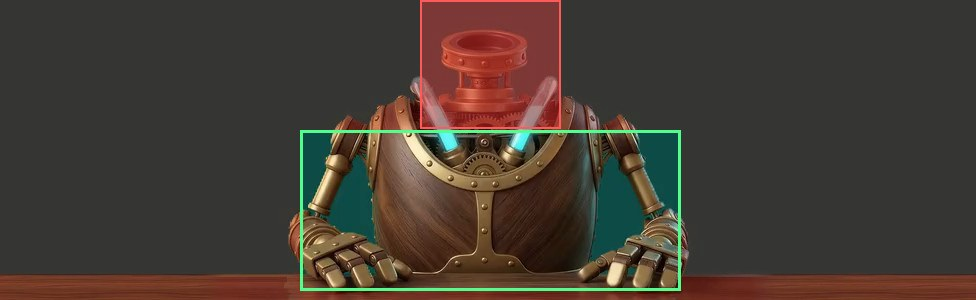

# GlazyArray's ball tricks: contact juggling prompts

New takes for the trick parts of her body video (`narrator.mp4`, in `js/narrator.js`): the brass ball, the teal ball
passed between her hands, the glowing orb, and the empty slot where the crystal ball came out. She shows off like a
contact juggler: the ball rolls and glides across her brass hands, slow and smooth, and never leaves them.

Each take below says which part it replaces, what happens second by second, and has a prompt ready to copy.

## Why the old ones went wrong

Her body video is a strip, **976 × 300**, keyed onto the Listen bar, and her **head is a separate layer** standing on
the neck collar. Anything that goes up near her head or out to the edges is lost:

- **The brass ball** rose past her collar to the top edge, so it slid behind her head layer and off the frame,
  vanishing mid-trick.
- **The teal ball and the orb** rolled in from off the edge, so they popped into view, and back out at the end.

## The safe area: where the ball and hands must stay

- **Low and central:** in front of her wooden chest plate and between her elbows, from her chest down to the desk.
  In the frame, roughly x 300 to 680 and y 130 to 290.
- **Never higher than the top of her chest plate.** Nothing in front of or above her neck column or collar: that's
  where the head layer sits.
- **Never at the edges:** the ball never enters from or leaves past the sides, top or bottom of the frame.
- **Never anything else:** her shoulders and torso stay put; only her forearms, hands and fingers move.

## Rules for every take

1. **Start and end in her rest pose:** give the generator `rest.jpg` as both the first and the last frame (or the
   16:9 frame it came from), so the take splices into her video without a jump.
2. **8 seconds, 24 fps, no sound,** green screen behind her, the camera locked.
3. **The ball comes and goes as light, never pops:** it condenses from a soft cyan glint in her cupped palms in the
   first second, and melts back into that glint before her hands return to rest.
4. **The ball is clear crystal glass,** about the size of her palm, with soft cyan light caught inside (her chest
   tubes' colour), so it reads on the dark green bar.
5. **Smooth and continuous:** the ball is always touching a hand, rolling and gliding, never tossed, caught or
   dropped. Slow, eased motion; no snaps.
6. **Her hands keep their joints:** articulated brass fingers bend only at the joints, never melt or add a finger.

**Paste this at the start of every prompt:**

> Locked-off static camera, zero pan, zoom or drift. The brass robot GlazyArray sits at her wooden desk against a
> flat green screen, exactly as in the first frame: her wooden chest plate, glowing cyan tubes and articulated brass
> arms. Only her forearms, hands and fingers move; her shoulders and torso stay still. All motion stays low in
> front of her chest, between her elbows and below the top of her chest plate, never near her neck or above her
> shoulders, and never near the edges of the frame. Slow, smooth, weightless, eased motion. The last frame matches
> the first: both hands resting on the desk.

**And this as the negative prompt (or at the end):**

> No tossing, throwing, catching, bouncing or dropping. Nothing floating away or leaving the frame. No ball above
> her shoulders. No camera movement. No extra fingers, no melting hands. No text, no logos, no people.

---

## 1. The suspended sphere (replaces the brass ball, part 10)

Fixed-point isolation: the ball hangs perfectly still in the air in front of her chest while her hands drift
around it.

- **0 to 1 s:** her hands lift from the desk and cup together at chest height; a cyan glint grows into the ball.
- **1 to 6 s:** she opens her hands; the ball stays pinned in place while her palms circle it in opposite
  half-circles, one sliding over the top as the other glides under, fingertips tracing the glass.
- **6 to 8 s:** her hands close around it, it melts back to a glint, and her hands settle on the desk.

> [The opening above.] She lifts both brass hands from the desk and cups them together low in front of her chest. A
> soft cyan glint grows between her palms into a clear crystal ball, the size of her palm, with cyan light caught
> inside. She opens her hands and the ball stays perfectly still in mid-air, pinned to one exact point in front of
> her chest, while her hands circle around it in slow opposite half-circles: one palm glides over the top of the
> glass as the other sweeps underneath, fingertips tracing its curve. The ball never moves; light refracts and
> shimmers through it. Then her hands close gently around it, the ball dissolves back into a soft cyan glint, and
> she rests both hands on the desk as at the start.

## 2. The glide (replaces the teal ball passed between her hands, part 16)

A horizontal slide: the ball floats in a perfectly level line from one hand to the other, with no bob.

- **0 to 1 s:** the ball forms in her left palm, held low in front of her chest.
- **1 to 6 s:** it glides slowly and dead level to her right hand, fingertips rolling under it while her other
  palm floats just above; then back again, a little slower.
- **6 to 8 s:** it rests in her left palm, melts to a glint, and her hands return to the desk.

> [The opening above.] A soft cyan glint grows into a clear crystal ball in her left brass palm, held low in front of
> her chest. The ball glides slowly in a perfectly flat, level line across to her right hand, never bobbing or
> wobbling: her fingertips roll continuously beneath it while her other palm floats just above, as if it slides
> on air. It glides back to her left hand a little slower, always touching her fingers, always low in front of her
> chest and well inside the frame. It settles in her palm, dissolves back into a soft cyan glint, and she rests
> both hands on the desk as at the start.

## 3. The butterfly (replaces the glowing orb, part 18)

A knuckle rollover: the ball rolls up over the back of her hand and down into the other palm, always on her
fingers.

- **0 to 1 s:** the ball forms in her right palm, low in front of her chest.
- **1 to 6 s:** she turns her hand over slowly; the ball rolls over her knuckles, along the back of her hand,
  and down into her left palm; then the same back the other way.
- **6 to 8 s:** it cradles in her fingertips, melts to a glint, and her hands return to the desk.

> [The opening above.] A soft cyan glint grows into a clear crystal ball in her right brass palm, low in front of her
> chest. She turns her hand over slowly and the ball rolls smoothly over her brass knuckles, along the back of her
> hand, and down into her open left palm, never leaving contact with her fingers. Then it rolls back the same way,
> over her left knuckles into her right fingertips, a continuous fluid roll like a butterfly move. Light glints
> across the brass and refracts through the glass. The ball dissolves back into a soft cyan glint in her
> fingertips, and she rests both hands on the desk as at the start.

## 4. The cage (fills the empty slot, parts 14 and 15)

An orbiting enclosure: her fingers form a loose cage that slowly revolves around a still, levitating ball.

- **0 to 1 s:** the ball forms between her cupped hands, low in front of her chest.
- **1 to 6 s:** her fingers open into a loose cage around it and revolve slowly round the ball, which stays
  still as if held by magnets; her fingertips brush the glass as they pass.
- **6 to 8 s:** the cage closes, the ball melts to a glint, and her hands return to the desk.

> [The opening above.] A soft cyan glint grows into a clear crystal ball between her cupped brass hands, low in front
> of her chest. Her fingers open into a loose cage around it, and her hands slowly revolve around the ball while
> it stays perfectly still, as if held between her fingers by magnets, her fingertips brushing the glass as they
> pass. The cyan light inside the ball brightens softly with each touch. The cage closes, the ball dissolves back
> into a soft cyan glint, and she rests both hands on the desk as at the start.

---

## Quick fixes when a take goes wrong

- **The ball rises toward her head:** add "the ball stays below the top of her chest plate the whole time" and
  lower the motion strength.
- **The ball pops in or out:** say "the ball forms from and dissolves into a soft cyan glint in her palm".
- **The camera drifts:** start with "locked-off static camera, zero pan or zoom" and try again.
- **Jerky hands:** in image-to-video tools, keep the motion strength low (about 2 to 4 out of 10).
- **It doesn't end at rest:** set `rest.jpg` as the last frame too, or Claude can blend the final second into it.

Bring the takes back as `.mp4` files named for the trick (`trick-sphere.mp4`, `trick-glide.mp4`,
`trick-butterfly.mp4`, `trick-cage.mp4`). Claude keys them, checks every frame stays inside the safe area, and
splices them into her video in place of the old ones.
